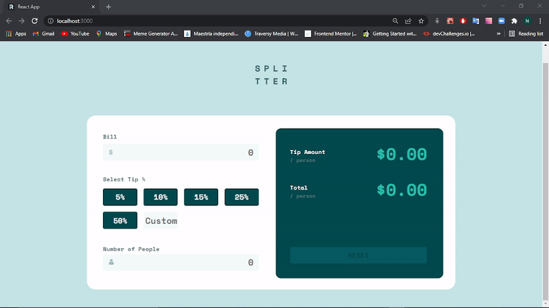
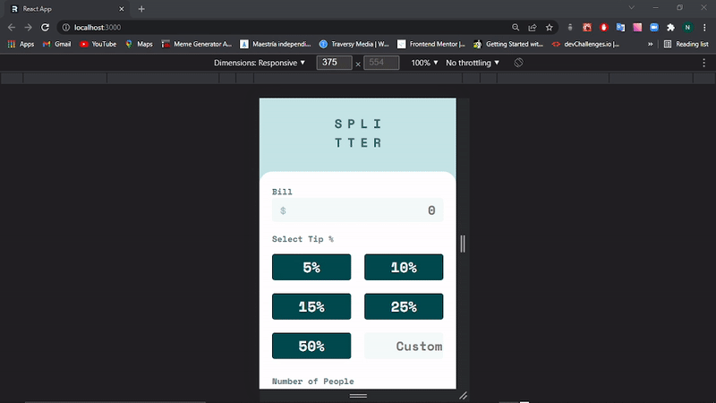

# Tip calculator app solution made with REACT JS

This is a solution to the [Tip calculator app challenge on Frontend Mentor](https://www.frontendmentor.io/challenges/tip-calculator-app-ugJNGbJUX).

## Tabla de contenido

- [Tip calculator app solution made with REACT JS](#tip-calculator-app-solution-made-with-react-js)
  - [Tabla de contenido](#tabla-de-contenido)
  - [Informacion general](#informacion-general)
    - [Desafio](#desafio)
    - [Screenshots](#screenshots)
    - [Links](#links)
    - [Echo con](#echo-con)
    - [Recursos utiles](#recursos-utiles)
  - [Autor](#autor)

## Informacion general

### Desafio

Sus usuarios deben poder:

- Ver el diseño óptimo de la app en función del tamaño de la pantalla de su dispositivo.
- Ver el estado de los elementos interactivos en la página
- Calcular la propina correcta y el coste total de la cuenta por persona

### Screenshots

### Links

- Solucion URL: [GITHUB](https://github.com/NicolasGula/tip-calculator)
- Sitio URL: [Tip Calculator with React](https://tipscalculatorwithreact.netlify.app/)

### Echo con

- [React](https://reactjs.org/) - JS library
- [Create React App](https://create-react-app.dev/) - Tool to create single-page React applications
- HTML5 
- CSS ,SASS
- Flexbox
- CSS Grid
- Mobile-first workflow

### Recursos utiles

- [React Hook useRef](https://www.w3schools.com/react/react_useref.asp) 
- [React Hook useState and useEffect](https://desarrollofront.medium.com/entendiendo-los-hooks-de-react-c%C3%B3mo-usar-usestate-y-useeffect-en-nuestros-componentes-611b9e826dfa#:~:text=La%20llamada%20a%20useEffect%20acepta,que%20el%20componente%20se%20actualice.&text=Tambi%C3%A9n%20es%20posible%20especificar%20cu%C3%A1ndo,opcional%20que%20le%20podemos%20pasar.) 
- [React onChange events](https://upmostly.com/tutorials/react-onchange-events-with-examples)
- [React useContext](https://dmitripavlutin.com/react-context-and-usecontext/)

## Autor

- Website - [Nicolas Gula](https://www.your-site.com)
- Twitter - [@nicolas_gula](https://twitter.com/nicolas_gula)

